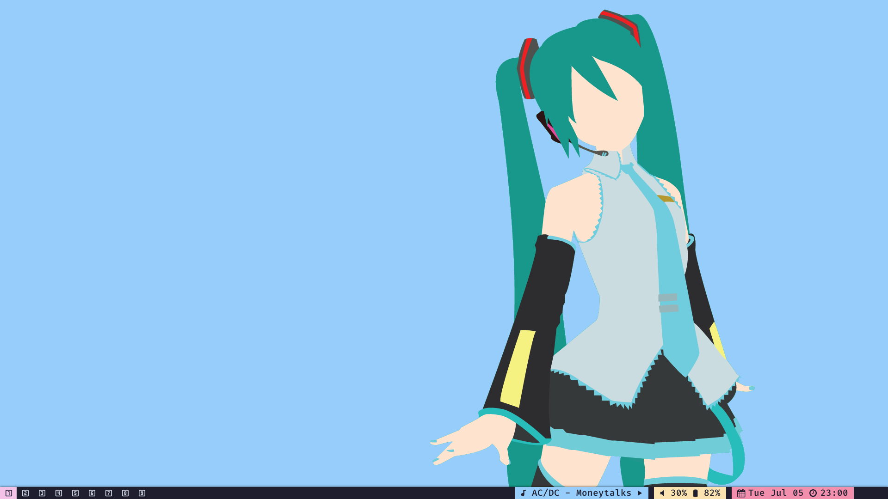
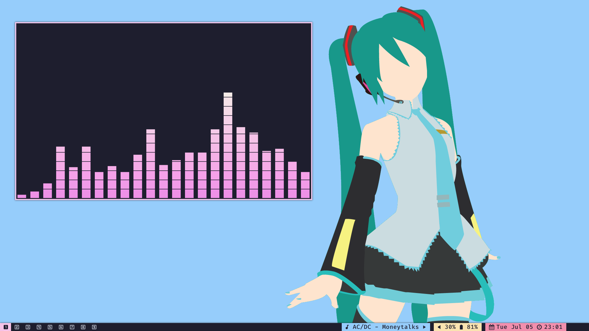
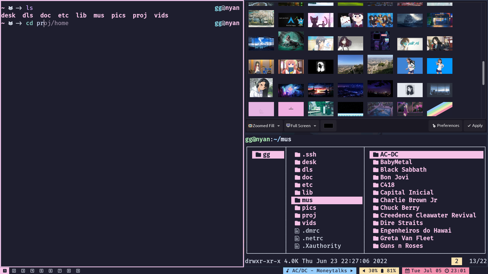

# GG's Integrated Development & Living Environment

GG's IDLE, or simply IDLE, is an post-installation script for Arch Linux and
Arch-based Linux distributions. It installs a complete custom desktop environment
created with suckless' DWM, integrated with other suckless' softwares like ST
and dmenu, other softwares like Vim, Zathura and mpd, and configurations for all
of them.

## Features

- Keyboard-driven desktop with the DWM window manager;  
- Integration with scripts (included) for music control, opening your IDE on
  a project folder, multi-monitor configuration and more;  
- Extremely lightweight;  
- Pretty and aesthetic, with the [catppuccin
  colorscheme](https://github.com/catppuccin/catppuccin)

## Installing

The script depends on the following packages:

- `git`: used to clone the configs and some programs.  
- `dialog`: used to create the curses dialogs on the script.  
- `sudo`: used to run commands as the user who'll use IDLE.  
- `yay`: used to install programs from the AUR. Need to be installed manually
  from the AUR. 
- `unzip`: used to unzip icon themes.  
- `wget`: used to download icon themes.  
- `base-devel`: meta-package with programs needed to install stuff from AUR and
  compile suckless' programs.  
- `xorg`: the meta-package of the X window system. The environment need it for
  obvious reasons.  

**NOTE**: You can uninstall all packages except `yay`, `base-devel`, `git`,
`sudo` and `xorg` after running the script.

## IMPORTANT: 

Sometimes you have some packages from `xorg` but do not have
`xorg-xsetroot`, which is needed by the environment. Make sure it's installed
before running the script!

The script will not install a login manager if you do not choose "lightdm" on
the additional configurations.

Also, you may need video drivers to properly run the x server and the
environment. Install them before running the script!

## Notes on Usage:

Suckless builds repository is cloned to `~/.local/share/suckless/`. As all
keybinds are handled by DWM, you may need to check the DWM's `config.def.h` to
see the default keybinds and change as you want.

# Screenshots

